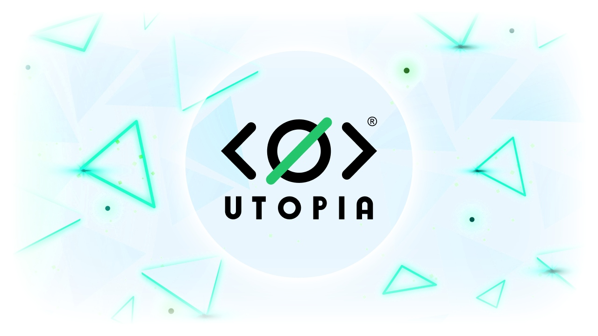

# What is Utopia?

The project offers great opportunities to build services, chatbots and applications that work within the ecosystem. By starting to master WEB 3.0 together with Utopia you contribute to being at the origins of new technologies and the first to build something in this new infospace.

Libraries for the most common programming languages were created for easy development, as well as examples of small projects.

<figure><figcaption></figcaption></figure>
