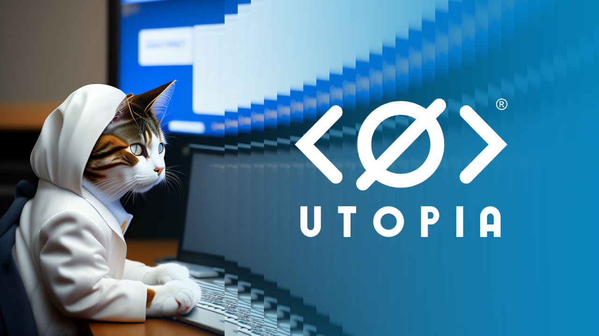

# How to earn in WEB 3.0

Create your channel now to carve out your niche in the new ecosystem. This will help you gain media exposure in the new world of WEB 3.0 and get the opportunity to make money from it.

We have [tools](crp.is-api/example-of-projects.md) for managing channels and working with audiences.

### Ways to monetize content in Utopia

* Collect donations from your subscribers.
* Sell posts in the channel.
* Collect maximum subscribers in a channel, and then sell this channel.
* Promote your own projects.
* [Join the content creator sponsorship program.](for-content-authors.md)

<figure><figcaption></figcaption></figure>

Utopia is an ever-growing multilingual ecosystem. Utopia brings together crypto enthusiasts, developers, entrepreneurs, creatives and more.

[Install Utopia ](./)right now for your platform.

