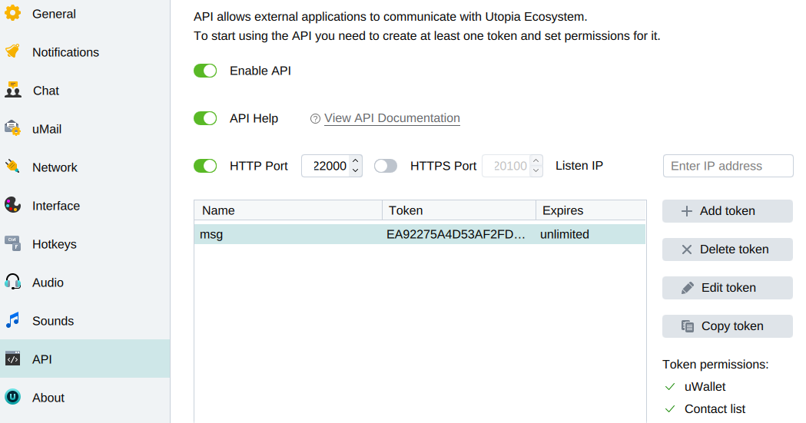

# How to enable API access

You need to go to the settings section from the top menu. Next, you need to find the "API" item in the menu on the left. Add a new token, select what to access and save the settings as shown in the screenshot.

<figure><figcaption></figcaption></figure>

When the "Enter IP address" field is not filled in, the API will listen on localhost (127.0.0.1)

The token and the port will be needed to specify them in the connection when you use this or that library to work with Utopia API.
