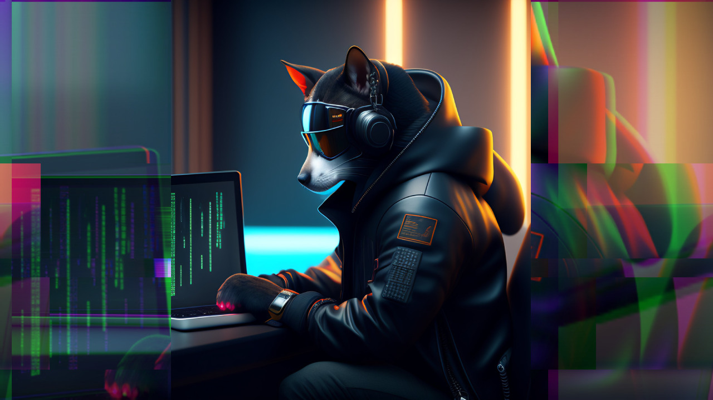
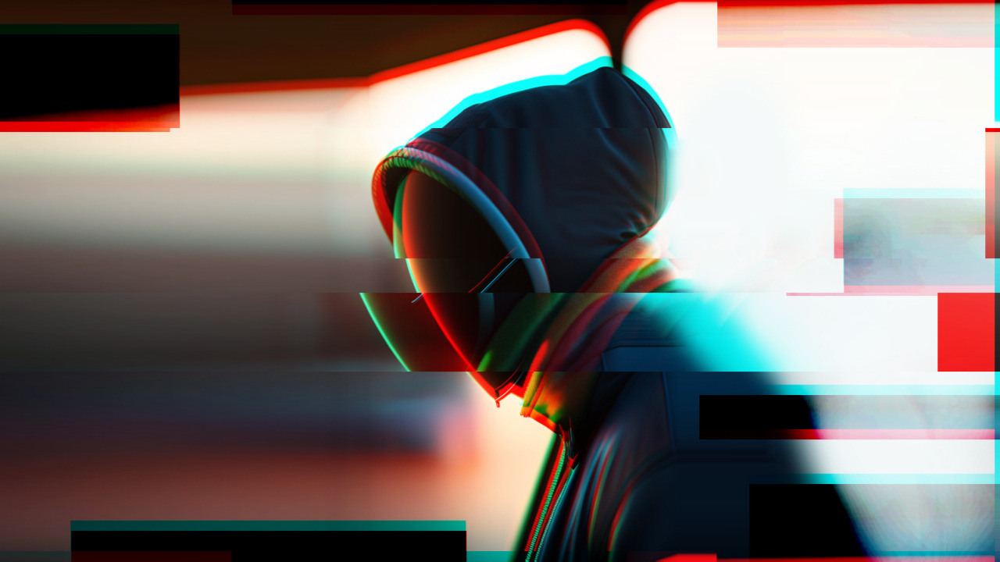

# Project Coins

### Crypton (CRP) - The most high-tech coin in WEB 3.0

<figure><figcaption>
A shadowy warrior who cannot be traced. The whole world is in his hands, but the world will never know it
</figcaption></figure>

This is a coin that is used to buy domain names (uNS - Utopia Name System). By buying CRP you become a shareholder of the project. The better a project becomes known, the more the community is engaged in its development, the higher the potential growth of the coin.

Also used in games. You can gather your friends to play crypto poker in Utopia and bet in CRP.

### UUSD (Utopia USD) - The world's first truly untraceable stablecoin

<figure><figcaption>
His strategy is to wait and plan, he knows how things work in this world and ultimately wins any fight
</figcaption></figure>

It is a stablecoin in which you can hold funds without fear of volatility.

The coin can be used for payments, to pay for services, to provide services to earn UUSD.

The wallet address is your public account key. This is the same address for CRP and UUSD.

You can get your first [coins for free by using a faucet.](https://get.crypton.click/)
